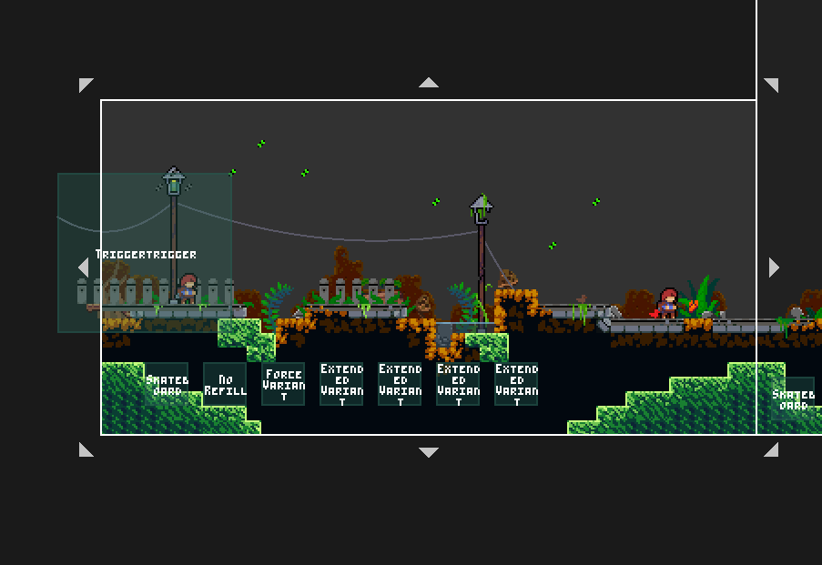

# Skateline

**EDIT**: Just learnt that CommunalHelper does the same thing with its *Player Addition Mod Trigger*, so ig I'll archive this. 

A Porting of the [2021 Strawberry Jam Collab's](https://gamebanana.com/mods/424541) Skateboard Trigger (Famously used in the amazing **_Forest Rush_**). This can be used as a tiny helper for your maps. Use as you wish.

- [Github](https://github.com/Cankyre/Skateline)

## Recreating Forest Rush's feel using Lönn

As you can see, Forest Rush uses multiple triggers in a row (with the help of [Cristalline Helper's TriggerTrigger](https://gamebanana.com/mods/53760)) which can be distilled into three major triggers. Here is what they are:

- First, the _Skateboard trigger_ you will find in this mod to update the player sprite
- Then, an _[Extended Variant Boolean trigger](https://gamebanana.com/mods/53650)_ to set the friction to 2.0
- Finally, another _Extended Variant Boolean trigger_ to set the air friction to 2.0 as well.

The other triggers are: _No refills_, _Force No Grabbing_ and _Disable neutral jumping_.
